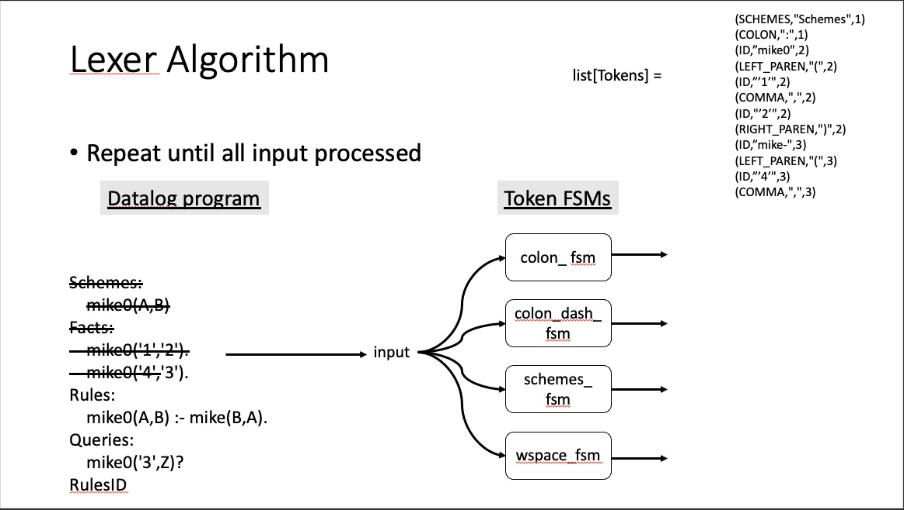
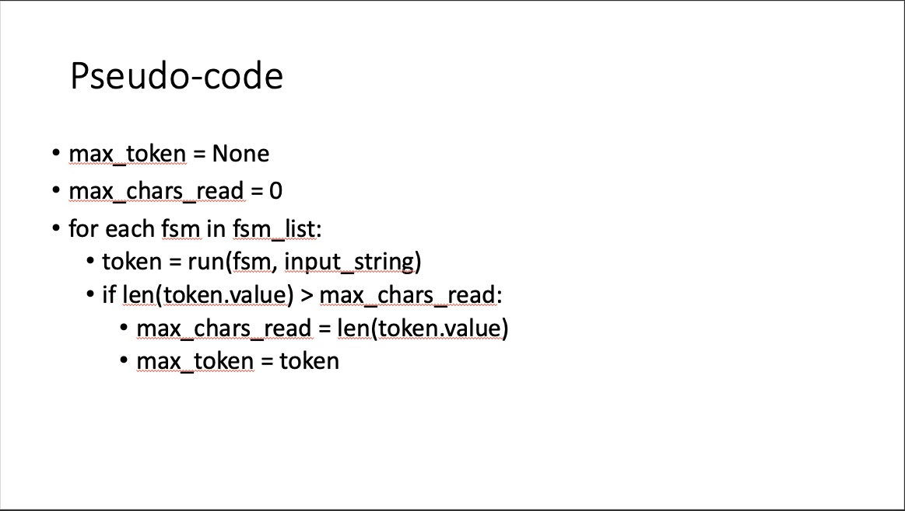

[](https://classroom.github.com/a/TEve1h55)
# Project 1

This project takes as input a string for a Datalog program and turns it onto a sequence of _tokens_ that form the input to a Datalog parser. A token is a representation of a syntactic element used to define a grammar such as a keyword or an identifier -- more on grammars later in the course.

The process to turn the input string into a token stream relies on giving the input string to a set of finite state machines (FSMs), each FSM in the set able to detect a specific syntactic element of Datalog, to see which token should be generated next with the part of the input string for that token. A state for an FSM takes as input the number of characters from the input read thus far and the next character to try to read. The state returns the next state for the FSM and the number of characters it has now read from the input string. All FSMs eventually end in an accept or reject state from which an appropriate token can be created.

The algorithm, and examples for implementing the FSMs and then iterating over the FSMs to determine which token to produce is in the lecture notes for Project 1 on [learningsuite.byu.edu](https://learningsuite.byu.edu) -- see the _Lectures_ in the _Content_ pane. **Before proceeding further, please review the Project 1 lecture slides with the associated Jupyter notebooks.**

## Developer Setup

The first step is to clone the repository created by GitHub Classroom when the assignment was accepted in a sensible directory. In the vscode terminal, `git clone <URL>` where `<URL>` is the one from GitHub Classroom after accepting the assignment. Or open a new vscode window, select _Clone Git Repository_, and paste the link they get when they hover over the "<> Code ▼" and copy the url

There is no need to install any vscode extensions. These should all still be present and active from the previous project. You do need to create the virtual environment, install the package, and install pre-commit. For a reminder to how that is done, see on [learningsuite.byu.edu](https://learningsuite.byu.edu) _Content_ &rarr; _Projects_ &rarr; _Projects Cheat Sheet_

  * Create a virtual environment
  * Install the package in edit mode: `pip install --editable ".[dev]"`
  * Install pre-commit: `pre-commit install`

The above should result in a `project1` executable that is run from the command line in an integrated terminal. As before, be sure the integrated terminal is in the virtual environment

## Files

  * `README.md`: overview and directions
  * `config_test.sh`: support for auto-grading -- **please do not edit**
  * `images`: folder for images referenced in `README.md`
  * `pyproject.toml`: package definition and project configuration -- **please do not edit**
  * `src`: folder for the package source files
  * `tests`: folder for the package test files

### Reminder

Please do not edit any of the following files or directories as they are related to _auto-grading_ and _pass-off_:

  * `config_test.sh`
  * `./tests/test_passoff_20.py`
  * `./tests/test_passoff_40.py`
  * `./tests/test_passoff_60.py`
  * `./tests/test_passoff_80.py`
  * `./tests/test_passoff_100.py`
  * `./tests/resources/project1-passoff/*`

## Overview

The project is divided into the following modules each representing a key component (see the Jupyter notebook tutorials for examples of using `token.py` and understanding `fsm.py` on [learningsuite.byu.edu](https://learningsuite.byu.edu) at _Content_ &rarr; _Project 1_ &rarr; _Project Description and Specification_ and _Content_ &rarr; _Lectures: Reading, Topics, Slides_ &rarr; _September Lectures_ &rarr; _FSMs in Project 1_):

  * `src/project1/token.py`: defines the `Token` class with methods to create tokens of each type needed for Datalog
  * `src/project1/fsm.py`: defines the `FiniteStateMachineClass` and how to run an instance of a `FiniteStateMachine`
  * `src/project1/lexer.py`: defines the interface for the lexer
  * `src/project1/project1.py`: defines the entry point for auto-grading and the command line entry point

Each of the above files are specified with Python _docstrings_ and they also have examples defined with python _doctests_. A _docstring_ is a way to document Python code so that the command `help(project1.lexer)` in the Python interpreter outputs information about the module with it's functions and classes. For functions, the docstrings give documentation when the mouse hovers over the function in vscode.

```
$ python
Python 3.12.3 (main, Apr 24 2024, 14:45:49) [GCC 10.2.1 20210110] on linux
Type "help", "copyright", "credits" or "license" for more information.
>>> import project1.lexer
>>> help(project1.lexer)
```

The `help` function can be called on functions, classes, or modules. This project comes with a fair amount of code already provided. Take time to read the docstrings either in the vscode editor or the Python interpreter to be sure you understand what you need, and do not need, to implement.

Associated with each of the above files are corresponding test files. For example, `src/project1/token.py` has a corresponding `tests/test_token.py` file. These test files demonstrate the test driven development approach encourage by the course and will be referenced as each file is discussed.

#### Python Imports

Our Python files are all organized in a package, so any import must reference the package first. So in the above example for the `help` function, we have `import project1.lexer`. We could also do `from project1.lexer import lexer` as below:

```
$ python
Python 3.12.3 (main, Apr 24 2024, 14:45:49) [GCC 10.2.1 20210110] on linux
Type "help", "copyright", "credits" or "license" for more information.
>>> from project1.lexer import lexer
>>> help(lexer)
```

The above example will show a different docstring. The first example is the docstring for the module. This second example is the docstring for the function `lexer`. There are several examples of how to import things in the package throughout the provided code.

### token.py

The `Token` class is fully implemented for you. Take a moment now to look at the code, read the docstrings, and review how the Token class was used in the Jupyter notebook referenced the [Overview](#overview). New is the use of the algebraic sum type `TokenType` as well as the other uses of the `Literal` type. These make it so `mypy` is able to type check that only tokens of type `TokenType` can ever be created and that when creating fixed string tokens such as COLON the value associated with that token type matches what the token should be.

Be sure you understand the examples in the docstrings before moving on. These can be run in the Python interpreter in the terminal by recreating the commands.

The `test_token.py` file checks that `str(token)` works as expected for each token type.

### fsm.py

This file implements an FSM and how to run an FSM. A few FSMs and the `run_fsm` function are implemented for you. The implemented FSMs are meant to be examples of what you need to do for the other FSMs.

The `run_fsm` is what steps an FSM until it accepts or rejects.
This `run_fsm` function is similar to `run` function in the Jupyter notebook tutorial and is adapted to the revised `FiniteStateMachine` class. The details are in the docstring that you can read directly in the file or using the `help` function in the Python interpreter.

```
$ python
>>> from project1.fsm import run_fsm
>>> help(run_fsm)
```

**Please study this function until you understand what it is doing.** It is key to completing the project since it is used to run the FSMs that you need to create. Use the example in the docstring and the Python interpreter to help in understanding.

`FiniteStateMachine` is the Python equivalent of the FSMs that are being discussed in class. The details are in the docstring for the class. Use the `help` function (see below) are open and read the docstrings in the file directly.

```
$ python
Python 3.12.3 (main, Apr 24 2024, 14:45:49) [GCC 10.2.1 20210110] on linux
Type "help", "copyright", "credits" or "license" for more information.
>>> from project1.fsm import FiniteStateMachine
>>> help(FiniteStateMachine)
```

The are three FSMs already provided with the project with tests in `test_fsm.py` for each one: `Colon`, `Eof`, and `Whitespace`. These are complete, and may be used _as is_. They are also examples of how to create the other FSMs required for the projects. There are **two tests** for each FSM: one that should reject and one that should accept. You can find these tests in the `tests` directory in the file called `test_fsm.py`. **Follow this pattern of testing for the other FSMs that you must implement.**

### lexer.py

The following diagram is an illustration of the what takes place during lexing. The input is given to each of the token FSMs, and the one that reads the most characters and has the highest priority in the case of a tie yields the token for that portion of the input. The list of tokens is in the upper right of the diagram. The list of machines in the center. And the input, with the already processed input crossed out, is in the left of the diagram.

<p align="center">

</p>

The general pseudo-code follows. The code gives the input to each of the state machines and keeps track of the machine that reads the most input characters with the resulting token. In the case of a tie, the machine that appears first in the array of FSMs has priority. Missing from the code is how an `UNDEFINED` token should be handled and `WHITESPACE`. For `UNDEFINED`, if no machine matches, then return `UNDEFINED` with the first character af the input as the value. For `WHITESPACE` it is it's own FSM, so it will match when it can, and create a `WHITESPACE` token that is to be ignored.

<p align="center">

</p>

The `lexer.py` file also includes similar pseudo-code with a few added details in the docstrings. **It is well worth your time to study and understand the provided pseudo-code in `lexer.py` before starting the project.**

```
$ python
>>> from project1.lexer import lexer
>>> help(lexer)
```

The `test_lexer.py` includes tests for the lexer that are suitable for the three FSMs that are provided. Review these tests because they are the starting point for the project. **Be sure you understand the tests before moving to the next section.**

### project1.py

The entry point for the auto-grader and the `project1` command. See the docstrings for details.

## Where to start

Here is the suggested order for Project 1:

1. Run the tests in `test_lexer.py` -- they should fail
1. Implement the `lexer` function in `lexer.py` -- `test_lexer.py` should pass when the implementation is done
1. Repeat until all the FSMs are implemented

    1. Choose an unimplemented FSM and write the accept and reject tests for it in `test_fsm.py`
    1. Run the new tests -- they should fail
    1. Create the state diagram (or state table) for the FSM to implement -- **we advise you to not skip this step**
    1. Implement the FSM from the state diagram (or state table)-- done when the new tests pass
    1. Write a new test in `test_lexer.py` that includes the newly implemented FSM
    1. Run the new test -- it should fail
    1. Add the new FSM to the `lexer` function -- done when the new test passes

1. Run the pass-off tests -- debug as needed

### Testing reminder

The testing pane is super convenient for running, and debugging tests. The integrated terminal is also super helpful. The `-k` flag is the easiest to find and choose a test since it uses matching. Try it out.

```
$ pytest -k lexer
=================================================================================================================================================== test session starts ===================================================================================================================================================
platform linux -- Python 3.12.3, pytest-8.2.0, pluggy-1.5.0
rootdir: /workspaces/project-1
configfile: pyproject.toml
collected 42 items / 38 deselected / 4 selected

src/project1/lexer.py .                                                                                                                                                                                                                                                                                             [ 25%]
tests/test_lexer.py ..F                                                                                                                                                                                                                                                                                             [100%]

...
```

Here the first test is the doctest in the docstring for the module. Anytime pytest sees what appears to be a capture from a Python terminal, it turns it into a test. These tests are called "doctests" and they are useful not just for examples but as a means to be sure the intended usage still works as intended. The doctest is also a very quick, and simple, way to test a function. Here is how to run just the doctest for the `project1` function in `project1.py`.

```
$ pytest -k project1.project1.project1
```

## Pass-off and Submission

The minimum standard for this project is **bucket 80**. That means that if all the tests pass in all buckets up to and including bucket 80, then the next project can be started safely.

The Project 1 submission follows that of Project 0:

  * Commit your solution on the master branch
  * Push the commit to GitHub -- that should trigger the auto-grader
  * Goto [learningsuite.byu.edu](https://learningsuite.byu.edu) at _Assignments_ &rarr; _Projects_ &rarr; _Project 1_ to submit your GitHub ID and Project 1 URL for grading.
  * Goto the Project 1 URL, find the green checkmark or red x, and click it to confirm the auto-grader score matches the pass-off results from your system.

### Branches

Consider using a branch as you work on your submission so that you can `commit` your work from time to time. Once everything is working, and the auto-grader tests are passing, then you can `merge` your work into your master branch and push it to your GitHub repository. Ask your favorite search engine or generative AI for help learning how to use Git branches.
